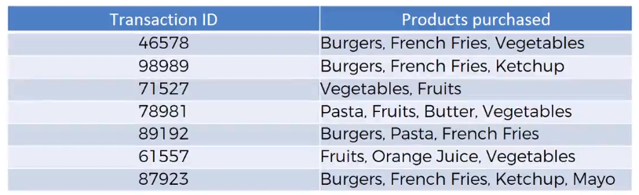

# Association Rule Learning Models
Association Rule Learning can help us analyze "People who bought also bought...".
- It's all about analyzing when things come in pairs, triplets, etc.
- We look for these rules or ways as to how items are correlated

ARL is also referred to as a "recommender system."

### Example of ARL
</img>

Potential associations (rules) are:
- Burgers -> French Fries
- Vegetables -> Fruits
- Burgers, French Fries -> Ketchup

### Real-Life Instance of ARL
A data science research conducted noticed that people who purchased diapers also purchased beer. But these two items are uncorrelated, so why?

One of the plausible explanations is that when the husband needs to purchase diapers for the baby he also purchases beer to re-stock his beer supply.