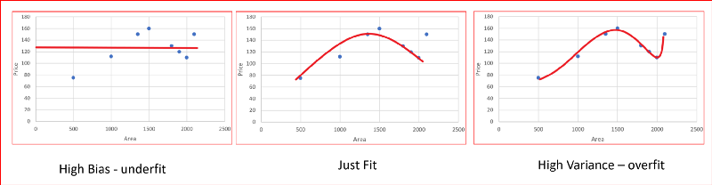

# Pre-Processing
Pre-Processing is needed to clean the data set before we fit it into a statistical model.

### Few Methods of Pre-Processing
1. Encoding Categorical Variables
2. Feature Selection (Dimensionality Reduction)
    - Technique to select certain features (independent variables) in a model
        - Removing features with missing values (or replacing their values with the mean)
        - Removing features with low variance
        - Removing features that are highly correlated to other features
        - Removing features that accept a null hypothesis
        - And many others!
3. Feature Extraction (Dimensionality Reduction)
4. Splitting Training and Testing Sets
5. Feature Scaling

And many others!

# Bias-Variance Trade-Off
</img>

https://www.endtoend.ai/blog/bias-variance-tradeoff-in-reinforcement-learning/

### Variance for Dependent Variable (Predicted Values)
How scattered are the predicted values from the actual values?
- High Variance: Model performs great on the trained data set, but not well on the testing data set

High Variance causes the machine learning model to overfit the data.
- This implies there's "random noise" (outlier) present in the training data
    - When a model is high-variant, then it becomes very flexible (fitted) to the training data points, which would be a problem when making predictions with an unknown or a test data set

### Bias for Dependent Variable (Predicted Values)
How far off are the predicted values from the actual values?
- High Bias: The average predicted values are very far off from the actual values

High Bias causes the machine learning model to underfit the data.
- This means the model is too simple and doesn't capture the complexity of the data set
    
