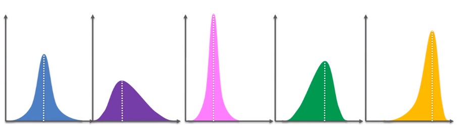

# Reinforcement Learning Models
This is also referred to as "Online Learning".

Reinforcement learning is about  maximizing positives rewards when performing actions within the learning environment.

### Example of Reinforcement Learning
Let's say we're training a cat to sit.

If a cat sits when its owner commands it, it will receive a treat (positive reward).  
If the cat doesn't sit when the owner commands it, it will get yelled at (negative reward).

The cat will realize that sitting on command receives positive rewards, so it learns to sit on command.

# Multi-Armed Bandit Problem
A one-armed bandit is a casino slot with a lever (called an arm).
- It's called a "bandit" because it's a joke that the slot scams the people playing the game

</img>

Multi-armed bandits are just multiple casino slots.

</img>

How do we play these multi-armed bandits to maximize our returns (positive rewards)?

Each machine has their own probability distribution that we don't know. Each distribution determines whether we win or lose, so the goal is to determine the optimal one-armed bandit to exploit.
- Regret: the amount of penalty for not choosing the optimal arm

</img>
- Each graph represents a one-armed bandit

The orange distribution is the best because its return is the largest.
- The return is the x-value in the middle of the curve, denoted by the dotted white-line

However, we don't know these probability distributions before-hand.

We need to simutaneously explore the machines (play other machines) while exploiting the machines (receive positive rewards) in order to approximate the probability distributions and exploit the best machine.
- The opposite is called A/B Testing: doing exploration first, then exploitation last
    - A/B Testing does exploration and exploitation separately (not simutaneously)

After enough trials of exploring and exploiting, we can determine the most optimal one-armed bandit to exploit, then play that one-armed bandit everytime to maximize our positive rewards.

### Other Applications of Multi-Armed Bandits
A common application is determining the best advertisement for a new product.

For instance, if there are 5 different advertisements for a new product, then after enough trials of exploring and exploiting we can determine the best advertisement for the product to show to consumers.

